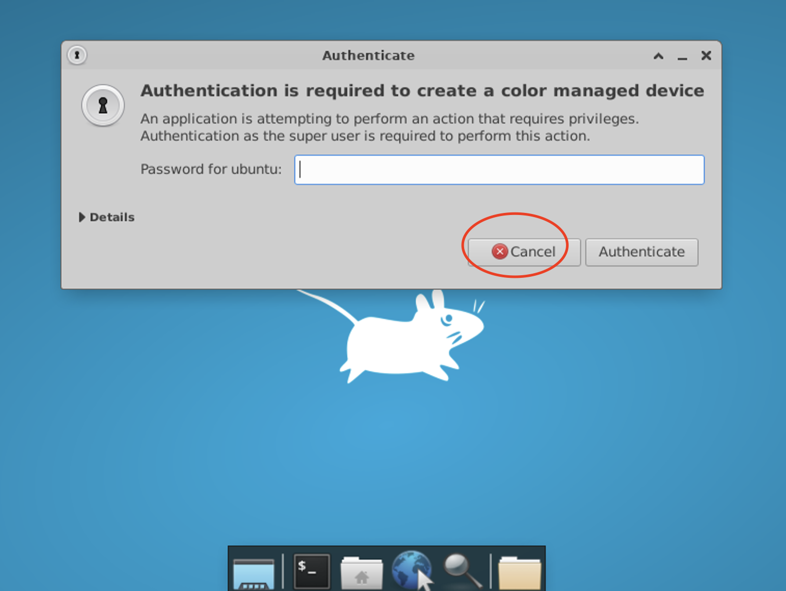
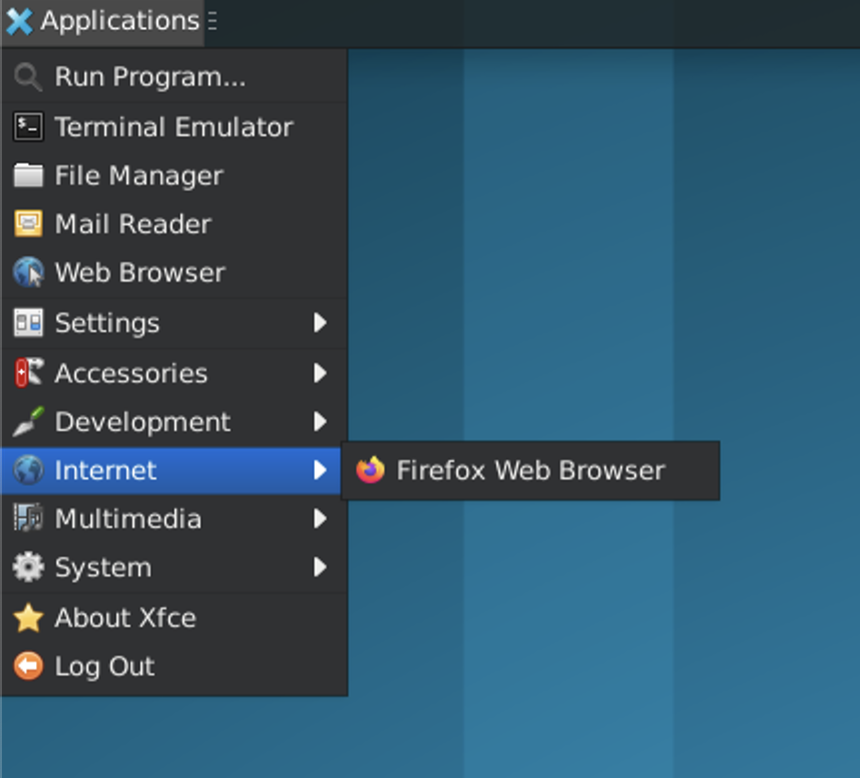
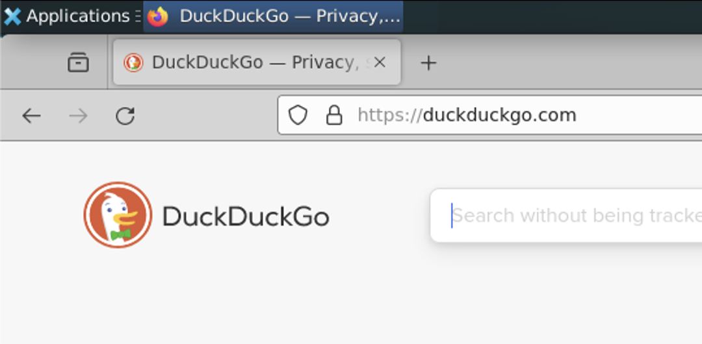
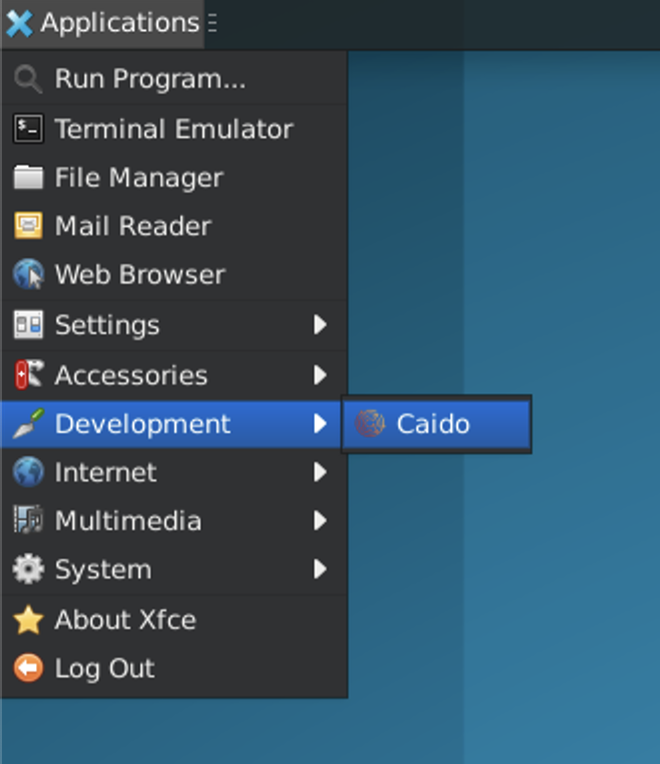
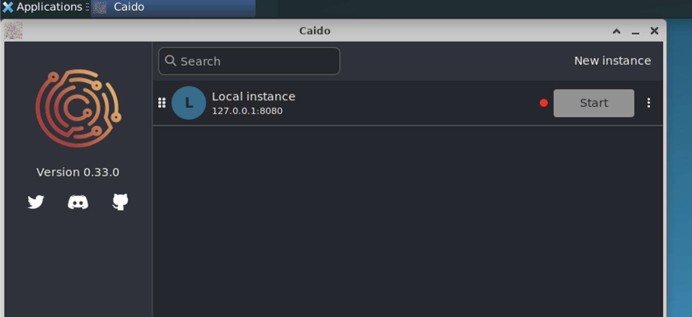

# xrdp-gcp-ce


GCP Compute Enging (VM) with enabled xrdp. Access to VM from the specific IP only. For simplicty I am using the same user for **ssh** and for **rdp**.

On VM are pre-installed (scroll down for details):
- **firefox**
- **caido**

### \# pre-steps
```
> adjust 'region' in variables.tf
> adjust 'machine_type' in main.tf
> adjust 'source_ranges' in fw_rules.tf (instead of <your_ip> you can use '0.0.0.0' although it's not recommended)

```

### \# terraform part

```
export GOOGLE_APPLICATION_CREDENTIALS=<service_account_key_name>.json

export RDPUSER=foo
export RDPPASS=bar

terraform init
terraform plan -var project=<project_name> -var user=$RDPUSER
terraform apply -var project=<project_name> -var user=$RDPUSER -auto-approve

terraform destroy -var project=<project_name> -var user=$RDPUSER -auto-approve
./clear.sh

<vm_pip> is visible in tf output

ssh -i id_rsa $RDPUSER@<vm_pip>
```

### \# ansible part

```
add <vm_pip> >> ./inventory/hosts.ini

ansible-playbook \
--extra-vars RDP_USER=$RDPUSER \
--extra-vars RDP_PASS=$RDPPASS \
setup.yml -i inventory/hosts.ini -vv

sudo nmap -v -Pn -p 22,3389 <vm_pip>

> to connect you can use 'Microsoft Remote Desktop'
```

After you connect you can **cancel** this:  
*"Authentication Required to Create Managed Color Device"*



**Firefox** you can find in `Applications / Internet`:




**Caido** you can find in `Applications / Development`:



